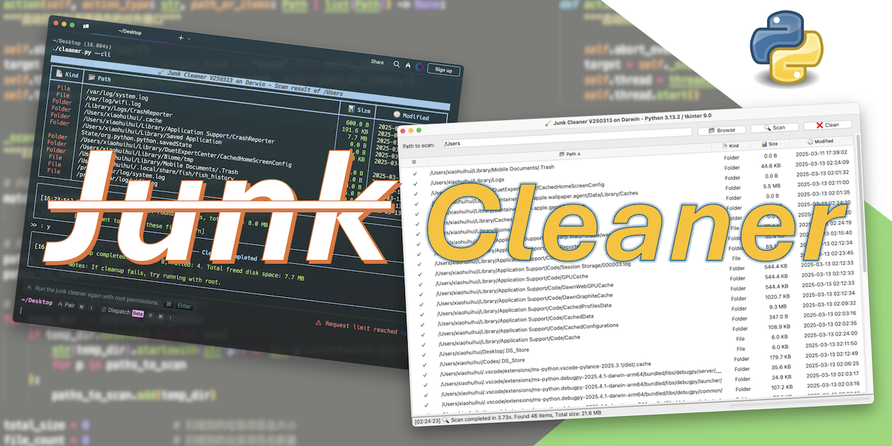
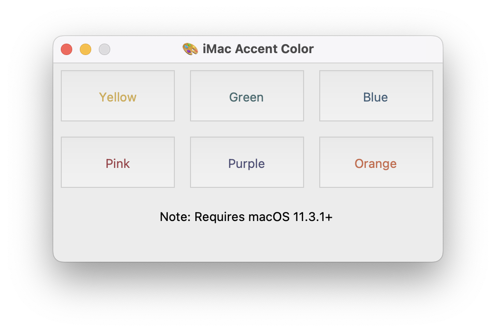
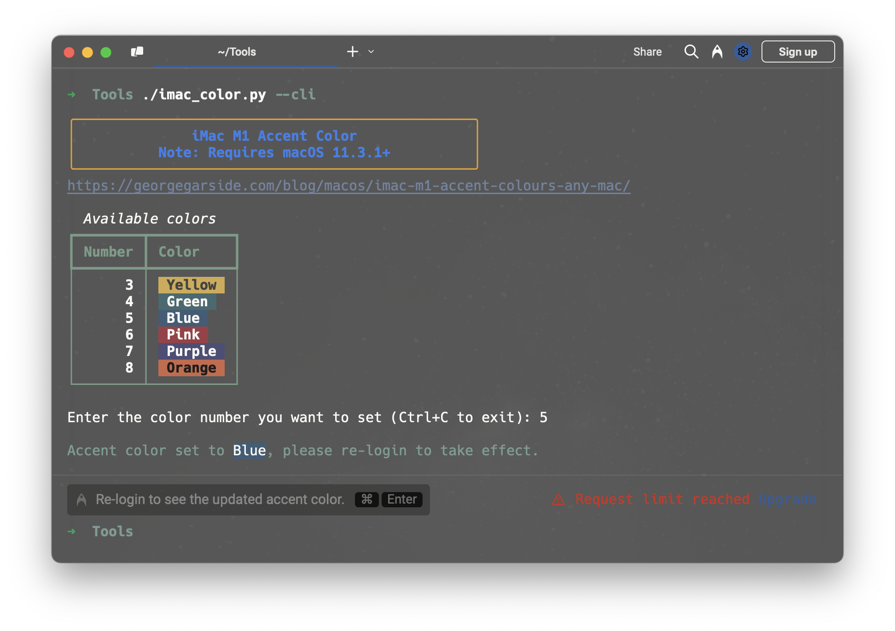
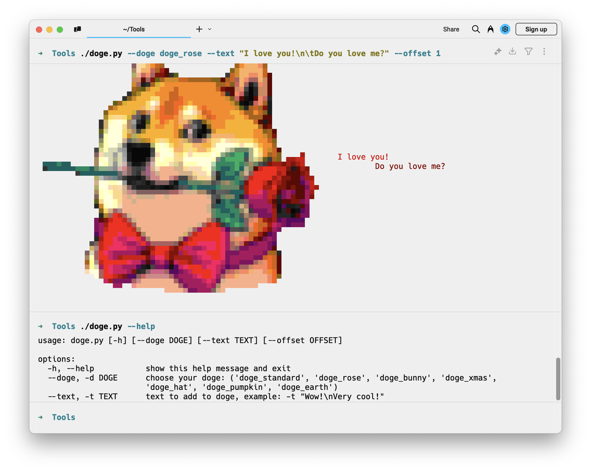

# 🧹 Junk Cleaner / 垃圾文件清理工具 - cleaner.py

<div align="center">
  
</div>

<p align="center">
A simple and efficient tool for scanning and cleaning system junk files.<br>
一个简单高效的系统垃圾文件扫描清理工具。
</p>

<div align="center">
  
  
  
</div>

## ✨ Features / 功能特点

- 🖥️ GUI and CLI modes / 支持图形界面和命令行两种模式
- ⚡ Fast scanning with multi-threading / 多线程快速扫描
- 🔍 Sort and filter scan results / 可排序和筛选扫描结果
- 🎯 Interactive selection for cleanup / 交互式选择要清理的文件
- 💻 Support for macOS/Windows/Linux / 支持 macOS/Windows/Linux
- 🔒 Safe cleanup with confirmation / 安全清理需确认
- 📊 Detailed scanning statistics / 详细的扫描统计

## 🚀 Quick Start / 快速开始

```shell
# Download & Install / 下载 & 安装
pip install rich
git clone https://github.com/roperescuer/junk-cleaner.git
cd junk-cleaner

# Set execution permissions / 设置运行权限
chmod +x cleaner.py

# Run in GUI mode / 以图形界面模式运行
./cleaner.py

# Run in CLI mode / 以命令行模式运行
./cleaner.py --cli

# Run with custom scan path / 指定扫描路径
./cleaner.py --path /path/to/scan

# Auto clean in CLI mode / CLI模式下自动清理
./cleaner.py --cli --auto
```

## 📋 Supported Files / 支持清理的文件

### 💻 System Files / 系统文件
- 🗑️ `.DS_Store`, `desktop.ini`, `Thumbs.db`
- 📜 `.bash_history`, `.zsh_history`, `.viminfo`
- 📁 `.Trash`, `.Spotlight-V100`, `.fseventsd`

### 📦 Cache Files / 缓存文件
- 💾 Browser caches / 浏览器缓存
- 📦 Application caches / 应用程序缓存
- 🗃️ System caches / 系统缓存

### 📄 Temporary Files / 临时文件
- 📄 `.log`, `.tmp`, `.cache`, `.temp`
- 📂 Temporary folders / 临时文件夹

## 🛠️ Development Environment / 开发环境
- Apple Silicon M1
- macOS Sequoia 15.3.2
- Python 3.13.2
- Visual Studio Code

(Develop and fully test only on Mac / 仅在 Mac 上进行开发并充分测试)

## 🔧 Prerequisites / 环境要求

- [Python 3.10+](https://www.python.org/downloads)
- [Tcl/Tk (tkinter) 9.0+](https://www.tcl-lang.org/software/tcltk/) (for GUI mode / GUI 模式需要)
- [rich 13.9.4+](https://pypi.org/project/rich/) (for CLI mode / CLI 模式需要)

## 📖 Usage / 使用说明

### 🖥️ GUI Mode / 图形界面模式

1. Select path to scan / 选择要扫描的路径
2. Click "Scan" to start scanning / 点击"扫描"开始扫描
3. Select files to clean / 选择要清理的文件
4. Click "Clean" to remove selected files / 点击"清理"删除所选文件

### 📟 CLI Mode / 命令行模式

```shell
usage: cleaner.py [-h] [--cli] [--auto] [--path PATH]

🧹 Junk Cleaner V250307

options:
  -h, --help             show help / 显示帮助信息
  --cli, -c              run in CLI mode / 使用命令行模式
  --auto, -a             auto clean without confirmation / 自动清理无需确认
  --path PATH, -p PATH   path to scan / 指定扫描路径
```

## ❓ FAQ / 常见问题

Q: Why does the scanning result contain paths other than the scanning path I specified? / 为什么扫描结果中会出现我指定的扫描路径以外的路径？

A: On the basis of the scanning path specified by the user, the program will additionally scan the system temporary files and log file directories. / 在用户指定的扫描路径的基础上，程序还会额外扫描系统临时文件和日志文件目录。

Q: Why are there items that failed to be cleaned up? How to solve it? / 为什么会有清理失败的项目？该如何解决？

A: Usually, the failure of cleaning is caused by a file permission problem. Please try to re run the program with root permission and scan and clean it. / 通常清理失败是由于文件权限问题导致的，请尝试以 root 权限重新运行程序并进行扫描和清理。

## 📦 Releases Notes / 发行说明

Packaging Python programs and the running environment together through [Nuitka](https://nuitka.net) or [PyInstaller](https://pyinstaller.org/en/stable/) can reduce the difficulty of distribution and deployment.

通过 [Nuitka](https://nuitka.net) 或 [PyInstaller](https://pyinstaller.org/en/stable/) 把 Python 程序和运行环境一并进行打包，可以降低分发和部署的难度。

Currently, only the [macOS arm64 version](https://github.com/roperescuer/junk-cleaner/releases) is available. For other platforms, please download the source code and install the Python environment and dependency package by yourself.

目前只提供 [macOS arm64 版本](https://github.com/roperescuer/junk-cleaner/releases)，其他平台请下载源码并自行安装 Python 环境和依赖包。

## ⚠️ Important Notes / 重要提示

- 🔐 Administrator Privileges: Administrative/root privileges are required to clean system files

    管理员权限：清理系统文件需要管理员/root权限

- 💾 Data Backup: Strongly recommend backing up important data before cleaning

    数据备份：清理前强烈建议备份重要数据

- ⚡ Performance Impact: Scanning process may temporarily affect system performance

    性能影响：扫描过程可能暂时影响系统性能

- 🛡️ Security: Do not delete system files that you are unsure about

    安全性：请勿删除不确定的系统文件

## ❤️ Special Thanks / 特别鸣谢

- GitHub Copliot Claude 3.5 Sonnet / AI代码大模型 Claude 3.5 Sonnet


# 🎮 Extra Gadgets / 额外的小玩意

### 🎨 imac-accent-colors / iMac 主题色设置工具 - imac_color.py

<div align="center">
  
  
</div>

Enable iMac M1 accent colors / 启用 iMac 主题颜色


Method from / 方法来自 https://georgegarside.com/blog/macos/imac-m1-accent-colours-any-mac/

### 🐕 Doge - doge.py

<div align="center">
  
</div>

Forked from [Olivia5k/doge](https://github.com/Olivia5k/doge) / 从 [Olivia5k/doge](https://github.com/Olivia5k/doge) fork

Thank the original author! / 感谢原作者！

### 🔄 Changes / 改动
- 🧹 Remove complex functionality / 去掉了复杂的功能
- 📄 All doge pattern in one file / 单文件
- ⚙️ Custom text / 支持通过命令行参数自定义显示文字

## 🗑️ Clear commit history / 清除仓库提交历史

```bash
git clone git@github.com:roperescuer/junk-cleaner.git
cd junk-cleaner
git checkout --orphan master
git add .
git commit -m "Initial commit"
git push -f origin master
```

### 📝 After Steps / 后续步骤
1. 🔍 Go to GitHub repository page, find `Settings` > `General` > `Default branch`
2. ✅ Set `master` as default branch
3. 🔄 Delete old branch, and rename new branch
